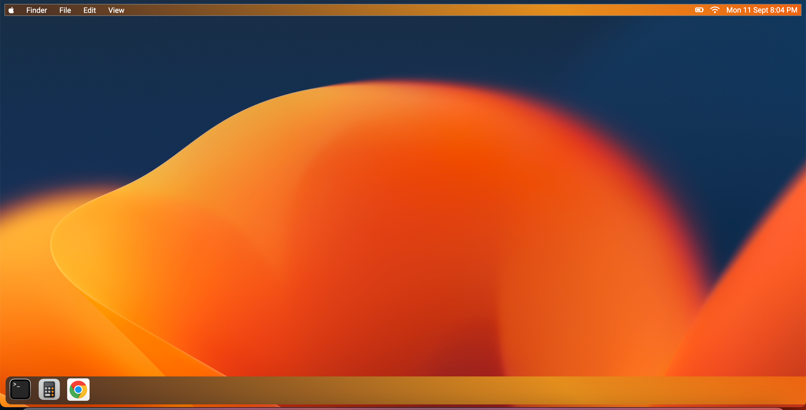
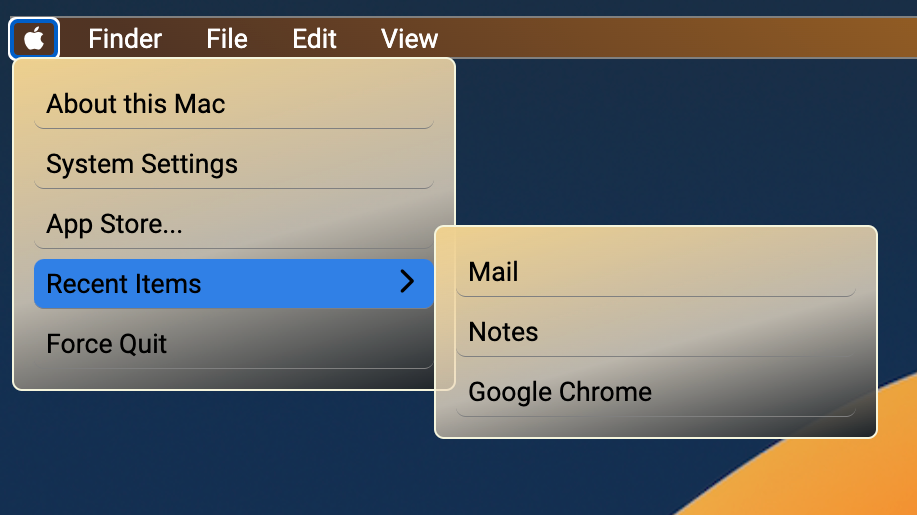
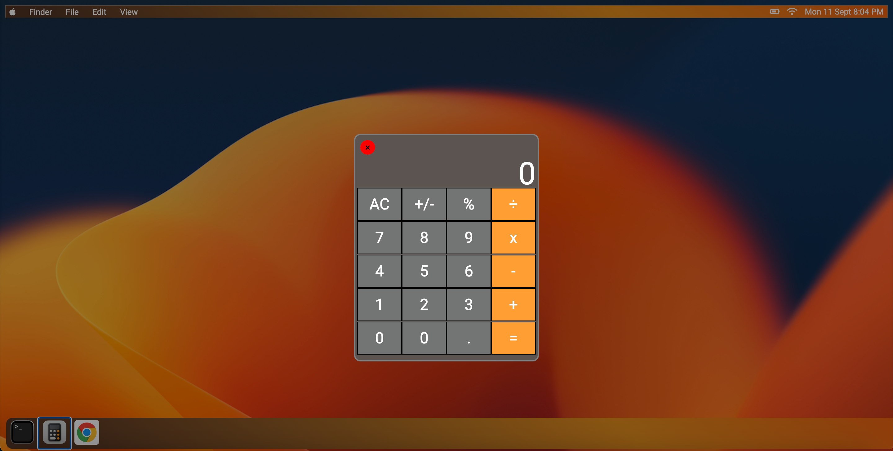
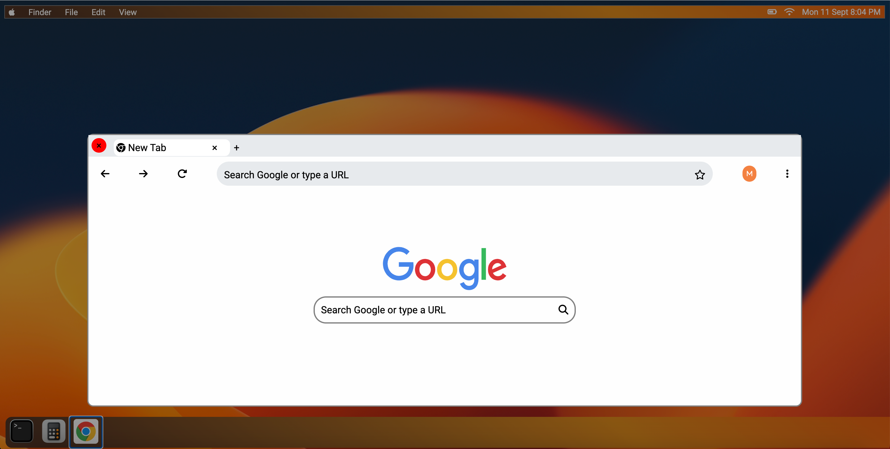

# fakeOS

## Demo

## Purpose

The purpose of the project was to replicate the design and some functionality of macOS through the use of HTML, CSS and Javascript.

## Features

- The dropdown menu is shown when clicked on the main menu items. The menu closes when the user clicks anywhere in the window, or on the same menu item, on a different menu it or anywhere inside the dropdown menu.

- The dropdown menu has another dropdown menu inside.

- Inidividual menu items are highlighted when cursor moves over them.

- Current date and time are shown on the right side of the navigation bar.

- The apps icon when clicked open a modal replicating the UI of that app.

- The modal closes when user clicks on the close button on the app.
